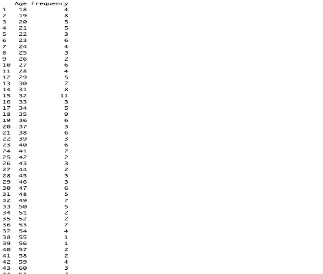

# :department_store: Analysis of Mall Customers

## :pushpin: Abstract

This report explores the Mall Customer Segmentation dataset taken from Kaggle. This dataset helps to understand the customer segmentation in a mall with the help of annual income and spending score that is available in the dataset. This report examines the mall customers in relation to their age, gender, annual income in dollars ($) and spending score i.e., from 1 to 100.
Keywords: dollars

## :mag: Analysis

Numerous findings have been found from the mall customer segmentation dataset focusing on the customer’s age, gender, annual income in dollars ($) and their spending score.

### :pager: Variables Of The Dataset

The mall customer segmentation dataset had a total of 5 columns but 4 columns were used for this analysis. They are:

* Gender – Gender of the customers i.e., male or female.
* Age – Age of the customers.
* Annual Income – Annual income of each client in thousands in the currency dollar ($).
* Spending Score – The spending score is between 1 and 100 based of defined parameters like customer behavior and purchasing data.

### :wrench: Data Cleaning and Initial Analysis

The dataset for the project was taken from Kaggle. The process for the analysis was as follows:

1. Extraction of Data – The dataset was extracted from Kaggle and consisted of a total of 5 columns with 200 records. The data was first analyzed by looking at the following parameters. They are:

2. Data Cleaning – The libraries used were dplyr, tidyr, magriitr, ggplot2, tidyverse, ggrepel, ggthemes and gmodels. The variable “CustomerID” was removed from the dataset as it had no significance in this analysis. For variable “Gender”, the values were replaced i.e., “Male” was replaced with “M” and “Female” was replaced with “F”.

### :bar_chart: Results

From the clean dataset, the following frequency tables, cross-tabulations and visualizations were created: (Note: most images were not fully captured due to the screen size)

**1. Frequency table of Customers Age**

This table represents the frequency of the customers according to their age. According to the table, there were 4 customers who were 18 years of age, 8 customers who were 19 years of age and so on. As such, the highest customers were of frequency 11 who were 32 years old and the least frequency was 0 who were 61 and 62 years old.

**2. Frequency table of Customer’s Annual Income**

This table represents the frequency of the customers’ annual income in thousands in the currency “$”. According to it, the income of $54,000 and $78,000 was highest with a frequency of 12 whereas there are multiple annual incomes with a frequency of 2.

Frequency tables can differ according to the class. For example, I changed the Annual income to character from integer. The result that I got was slightly different i.e., the annual incomes data of 101, 103, 113, 120, 126 and 137 was displayed in the beginning compared to the data when the annual income was in integer.

**3. Frequency table of Customer’s Spending Score**

This table represents the frequency of the customers’ spending score from the range 1 to 100. According to it, the spending score of 42 has the highest frequency of 8 and the spending score of 2, 19, 21, 25, 30, 33, 37, 38, 62, 64, 67, 70, 80, 84, 100 have the least frequency of 0.

**4. Frequency table of Age with Spending Score**

This table represents the frequency of the customers’ age with their spending score. According to it, the customers’ with age 21, 29, 30, 32, 35, 47, 48 and 58 along with their spending scores of 81, 88, 73, 74, 35, 16, 36 and 15 respectively have the highest frequency of 2.

**5. Frequency table of Age with Gender**

This table represents the frequency of the customers’ gender with their age. According to it, the female customers of age 31 visited the mall the most with a frequency of 7.

**6. Frequency table of Gender with Annual Income**

This table represents the frequency of the customers’ gender with their annual income. According to this table, there were male clients with an annual income of $54,000 and female clients with an annual income of $78,000 who visited the mall the most with a frequency of 7.

**7. Cross-tabulations between Gender and Annual Income**

This cross table represents the genders of the mall customers with their annual income. The table shows a detailed data of the customers with regards to the annual income with a division between the male and female clients.

**8. Cross-tabulations between Spending Score and Gender**

This cross table represents the genders of the mall customers with their spending score. The table shows a detailed data of the customers with regards to the spending score with a division between the male and female clients.

**9. Plot for Customer Gender**

Plot 1 represents the customer’s gender that visited the mall. From the chart, you can observe that there were more female visitors than male visitors. There were 112 female visitors and 88 male visitors in total.

**10. Plot for Mall Customers’ Age**

Plot 2 represents the age of the customers in this histogram. While looking at this chart, you’ll notice that the customers of age 34-36 were the highest at 15 and the customers of age 60-62 were the least at 0.

**11. Plot for Annual Income of Mall Customers**

Plot 3 represents the annual income of the clients. From this graph, you can see that there were customers who had an annual income of $52,000 to $54,000 with the highest count of 12 whereas, there were no customers that had an annual income of $30,000 to $32,000, $34,000 to $36,000, $50,000 to $52,000, $54,000 to $56,000 and $76,000 to $78,000.

**12. Plot for Spending Score**

Plot 4 represents the spending score of the clients. According to this, the highest spending score was between 40 and 50 whereas, the least spending score given to a customer was between 60 and 70.

**13. Plot for Annual Income with Spending Score**

Plot 5 represents the annual income of the customers with relation to their spending score. From this chart, you’ll notice that the highest number of customers fell in the 40 to 60 spending score category with an annual income of $40,000 to $60,000 and the least number of customers were in the 20 to 40 spending score category with an annual income of $0 to $20,000.

## :bust_in_silhouette: Author

[Jillien Chu](mailto:chu.jil@northeastern.edu)

## :memo: References

1. Kaggle Dataset from [click here](https://kaggle.com).

2. Choudhary, V. (n.d.). Mall Customer Segmentation Data. Retrieved November 4, 2021, from [https://www.kaggle.com/vjchoudhary7/customer-segmentation-tutorial-in-python](https://www.kaggle.com/vjchoudhary7/customer-segmentation-tutorial-in-python).

3. JournalDev. (2020, December 10). The sub() and gsub() function in R. Retrieved November 5, 2021, from [https://www.journaldev.com/43690/sub-and-gsub-function-r](https://www.journaldev.com/43690/sub-and-gsub-function-r).

4. Making Your Case:Using R for Program Evaluation. (2018, October 8). Using the gmodels CrossTable() function. Retrieved November 6, 2021, from [https://www.youtube.com/watch?v=55SBtMIKdJw&ab_channel=MakingYourCase%3AUsingRforProgramEvaluation](https://www.youtube.com/watch?v=55SBtMIKdJw&ab_channel=MakingYourCase%3AUsingRforProgramEvaluation).

5. Willems, K. (2019, March 11). How to Make a Histogram with ggplot2. Retrieved November 5, 2021, from [https://www.datacamp.com/community/tutorials/make-histogram-ggplot2?utm_source=adwords_ppc&utm_medium=cpc&utm_campaignid=12492439679&utm_adgroupid=122563407761&utm_device=c&utm_keyword=geom%20histogram%20r&utm_matchtype=b&utm_network=g&utm_adpostion=&utm_creative=504158802943&utm_targetid=aud-299261629654:kwd-615073076346&utm_loc_interest_ms=&utm_loc_physical_ms=1018127&gclid=Cj0KCQjwrJOMBhCZARIsAGEd4VEX0l_efnU1P6m3JgVeFptAgxmFyc7eqXv4uDf8q8Okpln9CA-fJ4EaAsW8EALw_wcB](https://www.datacamp.com/community/tutorials/make-histogram-ggplot2?utm_source=adwords_ppc&utm_medium=cpc&utm_campaignid=12492439679&utm_adgroupid=122563407761&utm_device=c&utm_keyword=geom%20histogram%20r&utm_matchtype=b&utm_network=g&utm_adpostion=&utm_creative=504158802943&utm_targetid=aud-299261629654:kwd-615073076346&utm_loc_interest_ms=&utm_loc_physical_ms=1018127&gclid=Cj0KCQjwrJOMBhCZARIsAGEd4VEX0l_efnU1P6m3JgVeFptAgxmFyc7eqXv4uDf8q8Okpln9CA-fJ4EaAsW8EALw_wcB).